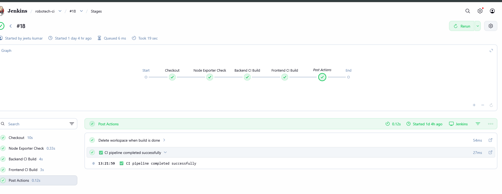
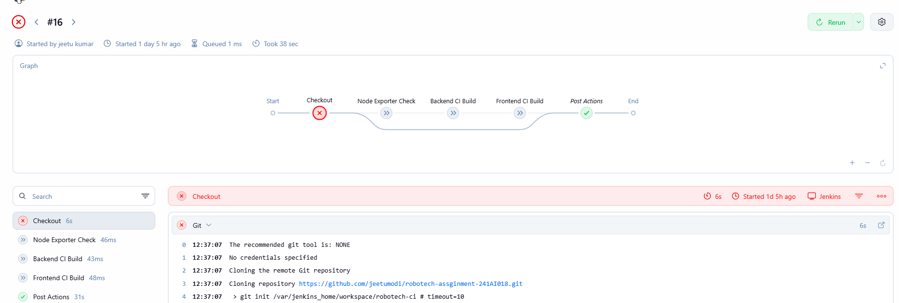
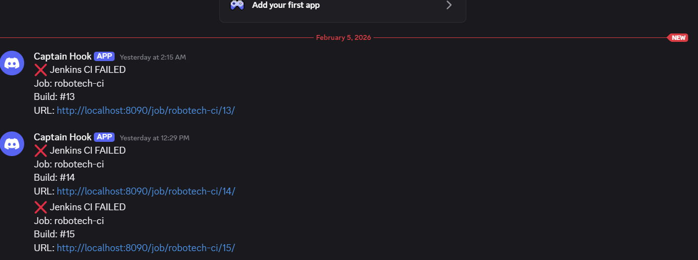
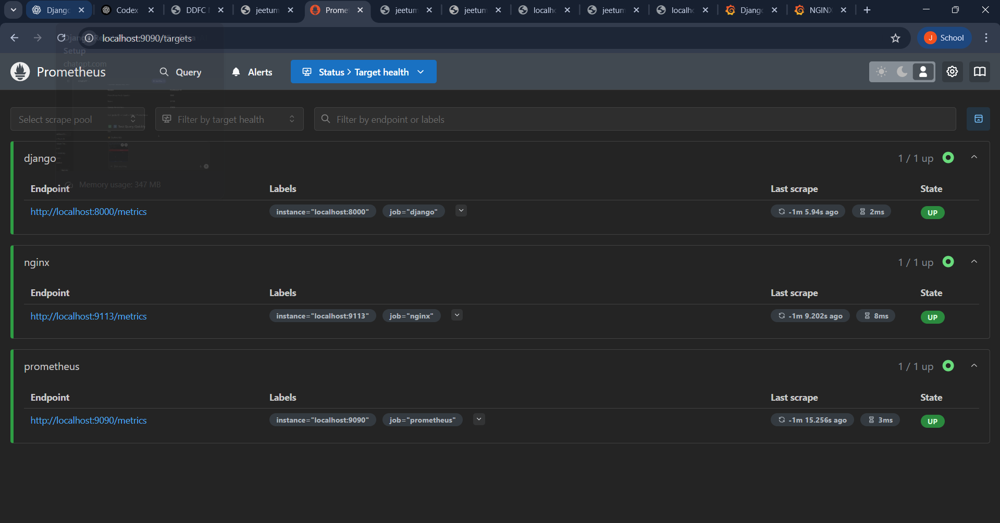
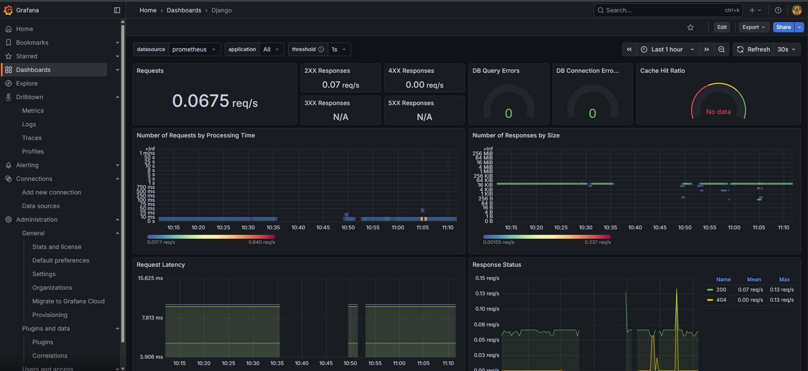
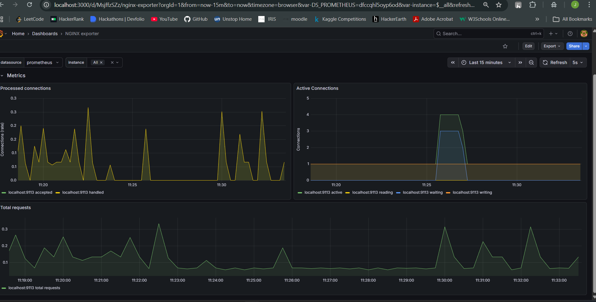
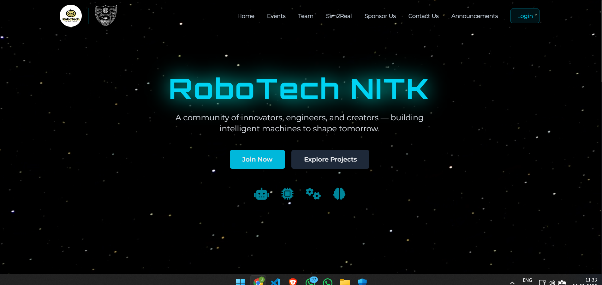

# RoboTech CI/CD, Prometheus, and Local Dev

This README focuses on the CI/CD pipeline, Prometheus monitoring setup, and local development steps.

## Contents

- [RoboTech CI/CD, Prometheus, and Local Dev](#robotech-cicd-prometheus-and-local-dev)
  - [Contents](#contents)
  - [Local Development](#local-development)
    - [Backend (Django)](#backend-django)
    - [Frontend (Vite)](#frontend-vite)
  - [CI/CD](#cicd)
  - [Prometheus Monitoring](#prometheus-monitoring)
  - [Screenshots](#screenshots)

## Local Development

### Backend (Django)

```bash
cd backend_django
python -m venv venv
venv\Scripts\activate
pip install -r requirements.txt
copy .env.example .env
python manage.py migrate
python manage.py runserver
```

API runs at `http://localhost:8000/`.

### Frontend (Vite)

```bash
cd frontend
npm install
echo VITE_API_BASE_URL=http://localhost:8000/api > .env
npm run dev
```

Frontend runs at `http://localhost:5173/`.

## CI/CD

The pipeline definition is in [Jenkinsfile](Jenkinsfile). It runs on GitHub push and performs:

- Checkout of branch `main` from the repo URL.
- Node Exporter availability check (`NODE_EXPORTER_URL`).
- Backend CI build using [Dockerfile.backend.ci](Dockerfile.backend.ci).
- Frontend CI build using [Dockerfile.frontend.ci](Dockerfile.frontend.ci) with `VITE_API_BASE_URL` build arg.

On failure, a Discord webhook notification is sent.

## Prometheus Monitoring

The Prometheus scrape config is in [prometheus.yml](prometheus.yml). It targets:

- Prometheus on `localhost:9090`.
- Django metrics on `localhost:8000`.
- Nginx exporter on `localhost:9113`.

## Screenshots
- CI/CD Success Pipeline

- CI/CD Faluire Pipeline

- Discord Alerts for ci/cd

- Prometheus Targets status

-Grafana DB

- Grafana Nginx

- Website home

